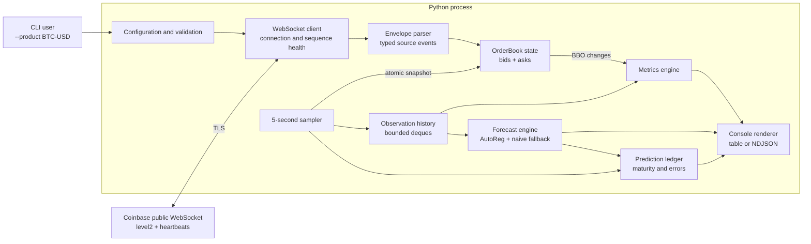

# Part 1: Coinbase Market Insights PoC Architecture

## 1. Decision summary

Build Part 1 as a **single, container-ready Python CLI application** that:

- accepts one Coinbase product such as `BTC-USD`;
- connects directly to Coinbase Advanced Trade's public WebSocket;
- reconstructs the Level 2 order book in memory;
- samples a valid top of book every five seconds;
- calculates the required current and rolling metrics;
- forecasts the mid-price 60 seconds ahead with an open-source model;
- prints one coherent output record every five seconds.

No cloud service, message broker, warehouse, or database is needed for Part 1. The challenge asks for a proof of concept with one live process and explicitly accepts a CLI. Adding Azure or Snowflake here would increase setup, cost, and failure modes without improving the required output.

Azure and Snowflake remain the preferred platforms when Part 2 is designed. AWS, Azure, and GCP all provide credible equivalents for this workload; none has a decisive general advantage that outweighs existing team expertise. For a real design, familiarity, organizational standards, regional availability, pricing, and existing contracts are valid selection factors. This Part 1 architecture stays cloud-neutral so it can later feed an Azure-based ingestion layer without rewriting the order-book domain logic.

## 2. Scope and assumptions

### Required outputs

For a user-selected product, emit every five seconds:

- current highest bid and its quantity;
- current lowest ask and its quantity;
- largest spread observed since this process started;
- average mid-price over the trailing 1, 5, and 15 minutes;
- forecasted mid-price 60 seconds ahead;
- average absolute error of matured 60-second forecasts over the trailing 1, 5, and 15 minutes.

### Explicit assumptions

- The product is a Coinbase spot product exposed by the public Advanced Trade feed.
- The product is selected at startup. Runtime product switching is outside scope, as allowed by the brief.
- Metrics are process-lifetime metrics; restarting the application resets history and the maximum spread.
- Output occurs on UTC-aligned five-second boundaries.
- Rolling mid-price averages use the valid five-second observations emitted by this process. With regular intervals, their arithmetic mean is also their time-weighted mean.
- The maximum spread is updated on **every valid top-of-book change**, not only at five-second output boundaries. This prevents a short-lived large spread from being missed.
- A missing or invalid book is reported as unavailable. The application never carries a value across a detected feed gap and presents it as current.
- Price forecasting is a PoC analytical estimate, not a trading recommendation.

## 3. Architecture



### Runtime model

Use one `asyncio` event loop with two long-lived activities:

1. **WebSocket reader:** receives and validates every envelope, tracks connection health, and applies complete events to the order book.
2. **Five-second sampler:** takes a coherent snapshot of the current best bid/ask, updates histories and matured forecast errors, requests a new forecast, and renders one output record.

All order-book mutations occur synchronously on the event-loop thread with no `await` inside a mutation. The sampler therefore sees either the state before or after an update, never a half-applied event. Forecast fitting can run through `asyncio.to_thread` so a slow numerical fit does not block feed consumption.

This is intentionally one process. Microservices would create network consistency problems between order-book state, sampling, forecasting, and output without providing value for one product and one user.

## 4. Source feed choice

Connect to:

```text
wss://advanced-trade-ws.coinbase.com
```

Subscribe on the same connection to:

- `level2` for the selected `product_id`;
- `heartbeats` to keep the connection open and make liveness observable.

The public channels do not require an API key. Support an optional JWT only as configuration because Coinbase recommends authentication for connection reliability; the default PoC must run without account signup.

### Why `level2`

The `level2` channel is the correct source because it provides:

- an initial full order-book snapshot;
- subsequent price-level updates;
- enough information to calculate exact best bid, best ask, quantities, spread, and mid-price.

The ticker channels are insufficient because they represent trades or sampled prices rather than the full current supply and demand. REST polling is also unsuitable: it can miss changes between polls and does not satisfy the streaming nature of the challenge.

### Feed semantics that control correctness

- Received order-book messages use channel `l2_data`.
- Event type is `snapshot` or `update`.
- Feed sides are `bid` and `offer`; normalize `offer` to domain value `ask` after parsing.
- `price_level` and `new_quantity` arrive as decimal strings.
- `new_quantity` is the **new absolute quantity**, not a change amount.
- Quantity `0` removes that price level.
- `event_time` is exchange-engine time; envelope `timestamp` is server-send time; the application also records local `received_at`.
- `sequence_num` is per connection and detects dropped or out-of-order envelopes. Because heartbeats and Level 2 share the connection sequence, sequence validation covers every received envelope, not only `l2_data` messages.

## 5. Internal component boundaries

### Configuration

Responsibilities:

- parse `--product`, output mode, optional JWT, log level, and forecast settings;
- normalize the product to uppercase;
- validate a conservative product pattern such as `^[A-Z0-9]+-[A-Z0-9]+$`;
- fail fast with a useful error before opening the socket.

Do not require a Coinbase REST lookup merely to validate startup. The WebSocket subscription response and first snapshot are the source of truth, avoiding another external dependency. A product that never produces a snapshot times out with a clear invalid/unavailable-product error.

### WebSocket client and connection health

Responsibilities:

- connect and send both subscriptions immediately;
- track `connection_id`, last sequence, last heartbeat, and reconnect count;
- detect sequence gaps, regressions, heartbeat timeout, malformed envelopes, and remote closure;
- reconnect with capped exponential backoff and jitter;
- invalidate the order book immediately on any continuity failure;
- mark the feed healthy only after a fresh snapshot is applied.

There is no honest way to reconstruct updates that Coinbase did not deliver during a public WebSocket interruption. A fresh snapshot restores correct current state, but the application must expose the interruption and must not claim gap-free history.

### Event parser

Use Pydantic models at the external boundary and plain domain dataclasses internally.

The parser:

- preserves timestamps and source sequence metadata;
- converts numeric strings to `Decimal`;
- normalizes `offer` to `ask`;
- rejects missing semantic fields and impossible values;
- ignores unknown additional fields for forward compatibility;
- produces typed `Snapshot` and `PriceLevelUpdate` domain events.

Pydantic is useful at the untrusted JSON boundary. It should not be used for every internal state mutation, where dataclasses and direct method calls are simpler and faster.

### Order book

Maintain two sorted maps:

```text
bids: price -> quantity   # best is maximum price
asks: price -> quantity   # best is minimum price
```

Use `sortedcontainers.SortedDict` with `Decimal` keys and values.

Rules:

- A snapshot atomically replaces both sides of the existing state.
- An update sets the absolute quantity at `(side, price)`.
- A zero quantity deletes the price level.
- The book is valid only after a snapshot on the current connection and while sequence continuity remains intact.
- Best bid is the last bid key; best ask is the first ask key.
- A valid top of book requires both sides, positive quantities, and `best_bid <= best_ask`.

`SortedDict` gives clear $O(\log n)$ updates and efficient access to both extrema. A normal dictionary would require an $O(n)$ scan for each best price. Two heaps would provide fast extrema but require lazy deletion and stale-entry bookkeeping, which is unnecessary complexity for this PoC.

Never use `float` for prices or quantities. Binary floating-point can represent decimal market values inaccurately and may break exact price-level identity. `Decimal` preserves the source representation and expected financial semantics.

### Five-second sampler and histories

Use the event loop's monotonic clock for scheduling and UTC wall-clock time for labels. Calculate the next UTC boundary rather than repeatedly sleeping five seconds, which would accumulate processing drift.

At each boundary:

1. Read one immutable best-bid/best-ask snapshot from the order book.
2. If valid and fresh, calculate spread and mid-price.
3. Append the observation to bounded history.
4. Mature forecasts targeting this boundary.
5. Calculate rolling metrics.
6. Generate the new 60-second forecast.
7. Render one output record.

Use timestamped `deque` collections bounded slightly beyond the largest required horizon:

- mid-price observations: at least 15 minutes plus forecast warm-up;
- forecasts awaiting maturity: at least 60 seconds plus tolerance;
- matured forecast errors: at least 15 minutes.

Deque pruning makes memory bounded and removes expired items in amortized $O(1)$ time.

## 6. Metric definitions

Let the current valid best bid be $(b_t, q^b_t)$ and best ask be $(a_t, q^a_t)$.

### Current top of book

$$
\text{highestBid}_t = (b_t, q^b_t)
$$

$$
\text{lowestAsk}_t = (a_t, q^a_t)
$$

### Spread and maximum spread

$$
s_t = a_t - b_t
$$

Update the process-lifetime maximum whenever a valid update changes the top of book:

$$
s_{max,t} = \max(s_{max,t-1}, s_t)
$$

The output includes both current spread and maximum spread even though only the maximum is explicitly requested; current spread makes the maximum interpretable.

### Mid-price

$$
m_t = \frac{a_t + b_t}{2}
$$

For window $W \in \{1,5,15\}$ minutes, include valid five-second samples whose timestamps are in $(t-W, t]$:

$$
\overline{m}_{W,t} = \frac{1}{N}\sum_{i=1}^{N}m_i
$$

If no valid observations exist, return unavailable rather than zero. Also expose the sample count so a partially filled startup window cannot be mistaken for a complete window.

### Forecast error

A forecast created at time $t$ predicts the mid-price at target time $t+60s$:

$$
e_{t+60} = |\widehat{m}_{t+60|t} - m_{t+60}|
$$

Only forecasts with an observed, valid target sample become matured errors. For each window, average errors by their target/maturity timestamp:

$$
\operatorname{MAE}_{W,t} = \frac{1}{K}\sum_{j=1}^{K}e_j
$$

If the target sample is unavailable because the feed was unhealthy, mark that prediction `unscored`; do not pair it with a later price and do not treat it as zero error.

## 7. Forecasting architecture

Use two forecasts:

1. **Naive persistence baseline:** the forecasted price equals the latest valid mid-price.
2. **Primary model:** `statsmodels.tsa.ar_model.AutoReg` fitted to first differences of the regular five-second mid-price series.

Concrete primary-model policy:

- Keep the most recent 15 minutes, up to 180 observations.
- Require at least 60 contiguous valid observations before fitting.
- Model first differences rather than raw price levels to reduce non-stationary trend effects.
- Use 12 lags, representing the previous 60 seconds.
- Forecast 12 five-second differences recursively and add their sum to the latest mid-price.
- Refit every five seconds on this small bounded window.
- Fall back to the naive forecast on startup, gaps, insufficient data, singular fits, non-finite output, or timeout.

The exact lag and history choices are configuration constants and must be stated in the output metadata. They are deliberately understandable rather than presented as optimized financial modeling.

### Why AutoReg over alternatives

| Option | Decision |
|---|---|
| Naive persistence | Always retain as baseline and fallback. It is difficult to beat for short-horizon prices and prevents overstating model value. |
| `statsmodels` AutoReg | Selected primary model. Lightweight, deterministic, open source, fast on 180 points, and easy to explain and test. |
| ARIMA | Reasonable alternative, but automated order selection/refitting every five seconds adds cost and instability without evidence of better PoC performance. |
| Prophet | Designed more for longer seasonal business series than noisy five-second market prices. |
| scikit-learn regression | Viable but requires manually constructing lag features; AutoReg directly expresses the time-series assumption. |
| Deep learning | Inappropriate for the data volume, latency, explainability, and scope of this challenge. |
| Snowflake ML / Azure ML | Useful in a later production architecture, but remote infrastructure is unnecessary for an in-process 60-second PoC forecast. |

Report primary and naive predictions and their rolling errors. If AutoReg does not beat persistence, say so; successful engineering does not require claiming that a noisy market is predictable.

## 8. Output contract

Support two renderers over one immutable result object:

- default human-readable console table;
- optional NDJSON for repeatable capture and downstream use.

Example logical record:

```json
{
  "product_id": "BTC-USD",
  "as_of": "2026-09-25T12:00:00Z",
  "feed_status": "healthy",
  "data_age_ms": 42,
  "highest_bid": {"price": "109999.10", "quantity": "0.42"},
  "lowest_ask": {"price": "110000.20", "quantity": "0.31"},
  "current_spread": "1.10",
  "max_spread_since_start": "3.40",
  "average_mid_price": {
    "1m": {"value": "109998.45", "samples": 12},
    "5m": {"value": "109990.12", "samples": 60},
    "15m": {"value": "109970.80", "samples": 180}
  },
  "forecast_60s": {
    "target_at": "2026-09-25T12:01:00Z",
    "model": "autoreg_diff_lag12",
    "value": "110005.30",
    "naive_value": "109999.65",
    "status": "ready"
  },
  "average_absolute_error": {
    "primary_1m": {"value": "8.21", "samples": 12},
    "primary_5m": {"value": "7.94", "samples": 60},
    "primary_15m": {"value": "8.12", "samples": 180},
    "naive_1m": {"value": "7.90", "samples": 12},
    "naive_5m": {"value": "8.02", "samples": 60},
    "naive_15m": {"value": "8.20", "samples": 180}
  }
}
```

Serialize all decimal values as strings in NDJSON. This preserves exact decimal representation for later consumers.

During startup or recovery, still emit a status record every five seconds with unavailable metric fields and a reason such as `awaiting_snapshot`, `insufficient_forecast_history`, or `feed_disconnected`. Silence would make operational failure indistinguishable from a quiet market.

## 9. Failure behavior

| Condition | Response | User-visible state |
|---|---|---|
| Initial connection failure | Retry with capped exponential backoff and jitter | `connecting` |
| No first snapshot before timeout | Reconnect, then fail clearly after configured startup limit | `awaiting_snapshot` or terminal error |
| Sequence gap/regression | Invalidate book immediately and reconnect | `sequence_gap` |
| Heartbeat timeout | Invalidate book and reconnect | `feed_stale` |
| WebSocket closure | Invalidate book and reconnect | `feed_disconnected` |
| Malformed semantic event | Log safe context, invalidate continuity, reconnect | `invalid_message` |
| Missing/crossed book | Suppress numeric metrics until valid | `invalid_book` |
| Forecast lacks history | Emit naive forecast only | `warming_up` |
| Forecast fit fails/times out | Emit naive forecast and log model error | `fallback` |
| Missing target observation | Mark prediction unscored | Error windows exclude it |
| SIGINT/SIGTERM | Close socket, cancel tasks, flush renderer, exit | Clean shutdown |

Logs go to `stderr`; metric records go to `stdout`. This permits piping NDJSON without mixing it with diagnostics. Logs must not contain JWTs or full subscription credentials.

## 10. Technology choices

| Concern | Choice | Reason | Alternative rejected |
|---|---|---|---|
| Language | Python 3.13 | Excellent async, decimal, time-series, CLI, and testing ecosystem; challenge-scale performance is sufficient | Java/Go offer higher throughput but more implementation ceremony; throughput is not the bottleneck for one product |
| Dependency management | `uv` with locked dependencies | Fast, reproducible environments and simple commands | Poetry is capable but heavier; raw `pip` without a lock is less reproducible |
| WebSocket | `websockets` | Focused asyncio API, mature, small conceptual surface | Coinbase SDK is unnecessary for a public channel and can hide protocol behavior important to the assessment |
| Boundary validation | Pydantic | Clear typed validation of external JSON and useful errors | Hand-written dictionary access is brittle; full schema generation is excessive here |
| Numeric type | `Decimal` | Exact price-level identity and financial arithmetic | `float` introduces binary rounding |
| Sorted state | `sortedcontainers.SortedDict` | Simple logarithmic updates and extrema | Dict scans are linear; heaps complicate deletion |
| Forecasting | `statsmodels` AutoReg | Small, explainable classical time-series model | Deep learning and hosted ML are disproportionate |
| CLI | `Typer` | Typed options, validation, help text, and low boilerplate | `argparse` avoids a dependency but produces more plumbing; Click is less type-driven |
| Human output | `Rich` | Stable readable tables and status formatting | Manual terminal formatting is fragile |
| Tests | `pytest`, `pytest-asyncio`, Hypothesis | Async tests plus property-based state-machine coverage | Example-only tests are weak for order-book update sequences |
| Packaging | Docker, non-root image | Reviewer reproducibility and later deployment portability | Requiring an exact host Python setup is less reliable |

Keep dependencies narrowly scoped. Python standard-library modules remain sufficient for deques, decimal arithmetic, timestamps, logging, signals, dataclasses, and JSON.

## 11. Module architecture

The intended source boundaries are:

```text
src/coinbase_insights/
  cli.py              # arguments, lifecycle, exit codes
  config.py           # validated configuration
  coinbase/
    client.py         # socket, subscriptions, reconnect, health
    messages.py       # Pydantic source contracts
    mapper.py         # source-to-domain normalization
  domain/
    events.py         # immutable domain events
    order_book.py     # snapshot/update state machine
    models.py         # BBO, observation, forecast, result records
  analytics/
    metrics.py        # spread, rolling averages, MAE
    forecasting.py    # baseline and AutoReg adapter
  runtime/
    sampler.py        # aligned five-second orchestration
    history.py        # bounded timestamped deques
  output/
    console.py        # Rich renderer
    ndjson.py         # machine-readable renderer
```

Dependencies point inward:

- Coinbase adapters depend on domain types.
- Analytics consume domain observations and know nothing about WebSockets.
- Output consumes result records and knows nothing about mutable state.
- The CLI is the composition root.

This separation is enough to make captured-feed replay and deterministic tests easy. It is not a generic framework and does not introduce repository/service abstractions where plain objects suffice.

## 12. Correctness and quality gates

The architecture is acceptable only if these behaviors can be demonstrated:

- A snapshot replaces all previous price levels.
- Absolute updates insert, replace, and delete levels correctly.
- Best bid/ask and quantities remain correct under randomized update sequences.
- Prices differing only beyond normal float precision remain distinct.
- No metric is emitted from a book before its snapshot or after a sequence gap.
- Maximum spread captures transient BBO changes between sample boundaries.
- Five-second sampling does not drift over a long run.
- Rolling windows include exactly $(t-W, t]$ and expose sample counts.
- A forecast created at $t$ is scored only against the valid sample at $t+60s$.
- Missing target samples are unscored rather than shifted or zero-filled.
- AutoReg failure cannot interrupt feed ingestion or metric output.
- Recorded Coinbase fixtures produce deterministic outputs under a fake clock.
- The process reconnects, waits for a new snapshot, and resumes without carrying stale state.

## 13. Deliberate exclusions

The following belong to Part 2 or exceed the Part 1 brief:

- Azure Event Hubs, Functions, Container Apps, AKS, Blob Storage, or monitoring architecture;
- Snowflake ingestion, warehouse schemas, dbt, scheduled ML, or dashboards;
- Kafka or another durable message broker;
- multi-product distributed processing;
- persistent cross-restart metrics;
- web GUI, API service, authentication, and multi-user access;
- infrastructure as code, production SLAs, multi-region recovery, and cloud cost modeling;
- step-by-step implementation or delivery stages.

These are excluded intentionally, not overlooked. They should be reconsidered when Part 2 is designed against its different durability, serving, governance, and scale requirements.

## 14. References checked

Accessed 2026-09-25:

- Coinbase Advanced Trade WebSocket endpoints: <https://docs.cdp.coinbase.com/coinbase-app/advanced-trade-apis/websocket/websocket-channels>
- Coinbase Level 2 channel schema and semantics: <https://docs.cdp.coinbase.com/api-reference/advanced-trade-api/websocket/level2>
- Coinbase heartbeat channel: <https://docs.cdp.coinbase.com/api-reference/advanced-trade-api/websocket/heartbeats>
- statsmodels AutoReg: <https://www.statsmodels.org/stable/generated/statsmodels.tsa.ar_model.AutoReg.html>