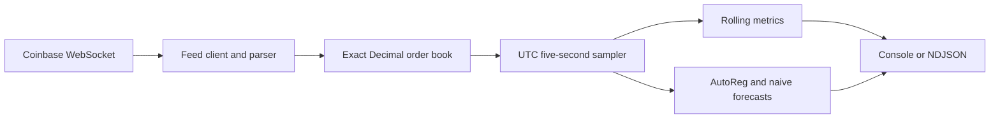

# Coinbase Market Insights

A production-minded Part 1 proof of concept for the 2026 Data Engineer Challenge. The application consumes Coinbase Advanced Trade Level 2 and heartbeat channels, reconstructs one product's order book, and emits market metrics and a 60-second forecast every five seconds.

Part 2 infrastructure is intentionally out of scope.

## Architecture

The implementation is a single-process Python 3.13 CLI. Source parsing, domain state, analytics, runtime orchestration, and rendering have separate ownership boundaries.



See [docs/architecture.md](docs/architecture.md) for the implemented design and [docs/testing.md](docs/testing.md) for evidence and fixture provenance.

## Prerequisites

- Python 3.13
- [uv](https://docs.astral.sh/uv/) 0.12.19 or compatible
- Docker, only for the container workflow
- Internet access to run the live application

Install the locked development environment:

```bash
uv sync --frozen --all-groups
```

## Run

No Coinbase account or credentials are required:

```bash
uv run coinbase-insights --product BTC-USD
```

Select machine-readable output with:

```bash
uv run coinbase-insights --product ETH-USD --output ndjson
```

The default console renderer displays the current top of book, spread, rolling averages, forecast, and matured errors. NDJSON emits one complete object per UTC-aligned five-second boundary. Prices, quantities, forecasts, and errors are fixed-point strings so decimal market values remain exact.

Coinbase JWT authentication is optional. Set `COINBASE_JWT` in the process environment when required; do not put credentials in command history, source files, images, or logs. The application never prints the configured secret.

## Quality Checks

```bash
uv lock --check
uv run ruff format --check .
uv run ruff check .
uv run pyright
uv run pytest
```

The default pytest command includes branch coverage and enforces the configured 80% repository threshold. Required tests are deterministic and do not contact Coinbase.

Build and inspect the non-root container:

```bash
docker build -t coinbase-insights:local .
docker run --rm coinbase-insights:local --help
docker run --rm coinbase-insights:local --product BTC-USD --output ndjson
```

Runtime arguments follow the image name. The image uses an exec-form entrypoint so host signals reach Python.

## Correctness And Recovery

A snapshot replaces the complete book; updates set absolute quantities and zero removes a level. Prices and quantities use `Decimal`, never `float`. The maximum spread is observed on every valid best-price change, while rolling windows include observations in $(t-W,t]$.

Sequence gaps, regressions, malformed messages, heartbeat expiry, and disconnects invalidate the book immediately. Numeric output remains unavailable until a new connection supplies a fresh snapshot. Historical observations are not presented as current state.

The primary forecast fits `statsmodels` AutoReg to first differences of up to 180 five-second observations, using 12 lags and a 12-step horizon. It requires 60 observations. A naive persistence forecast is always retained as a baseline and fallback. Forecast errors mature only at the exact 60-second target; missing target observations are unscored. Neither forecast is a trading recommendation, and the primary model should be judged against the naive error rather than assumed to be predictive.

## Assumptions And Limitations

- One Coinbase spot product is selected at startup.
- State, histories, and maximum spread reset when the process restarts.
- Recovery restores correct current state but cannot reconstruct market changes missed during a feed gap.
- The public feed, network, and product validity remain external dependencies for live runs.
- Snapshot parsing and order-book mutation occur on the event-loop thread for atomic state transitions. A signal received during unusually large synchronous message processing is handled when that processing yields.
- Performance measurements in [docs/testing.md](docs/testing.md) are point-in-time evidence, not service-level guarantees.

## Working With AI

TODO
