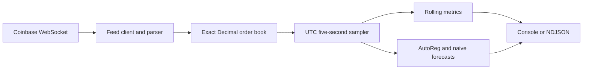

# Coinbase Market Insights

The core data ingestion part of Coinbase PoC. It consumes Coinbase Level 2 market data for one product and emits order-book metrics and a 60-second mid-price forecast every five seconds.

## Architecture

The implementation is a single-process Python 3.13 CLI:



See [docs/architecture.md](docs/architecture.md) for design details and [docs/testing.md](docs/testing.md) for test and live-verification evidence.

## Prerequisites

- Python 3.13
- [uv](https://docs.astral.sh/uv/) 0.12.19
- Internet access for the Coinbase feed
- Docker (optional)

Install the locked development environment:

```bash
uv sync --frozen --all-groups
```

## Run

No Coinbase account is required:

```bash
uv run coinbase-insights --product BTC-USD
```

Use NDJSON for machine-readable output:

```bash
uv run coinbase-insights --product ETH-USD --output ndjson
```

Optional authentication uses the `COINBASE_JWT` environment variable; the public feed works without it.

## Representative Output

Illustrative NDJSON record, not a guaranteed live value:

```json
{
    "product_id": "BTC-USD",
    "as_of": "2026-09-25T12:00:00Z",
    "feed_status": "healthy",
    "highest_bid": {"price": "109999.10", "quantity": "0.42"},
    "lowest_ask": {"price": "110000.20", "quantity": "0.31"},
    "current_spread": "1.10",
    "max_spread_since_start": "3.40",
    "average_mid_price": {"1m": {"value": "109998.45", "samples": 12}},
    "forecast_60s": {"value": "110005.30", "naive_value": "109999.65"}
}
```

Decimal values are strings to preserve exact market values. Full records include 1/5/15-minute averages and primary/naive forecast errors.

## Quality Checks

```bash
uv lock --check
uv run ruff format --check .
uv run ruff check .
uv run pyright
uv run pytest
```

Tests are deterministic and network-free; `pytest` includes branch coverage with an 80% minimum. Optional live-test instructions are in [docs/testing.md](docs/testing.md).

Container:

```bash
docker build -t coinbase-insights:local .
docker run --rm coinbase-insights:local --help
docker run --rm coinbase-insights:local --product BTC-USD --output ndjson
```

## Key Assumptions

- One Coinbase spot product is selected at startup.
- Prices and quantities use exact `Decimal` values.
- State and rolling histories reset on restart.
- A feed gap invalidates the book; output remains unavailable until a fresh snapshot arrives. Missed events cannot be reconstructed.
- AutoReg is compared with a naive persistence baseline and falls back safely during warm-up or model failure. Forecasts are analytical estimates, not trading advice.

## Working with AI

TODO
