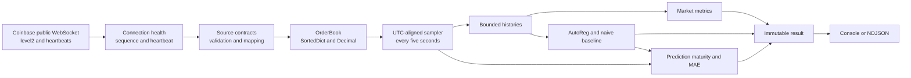

# Implemented Part 1 Architecture

## System shape

Coinbase Market Insights is one asynchronous Python process. This keeps the order book, sample clock, rolling histories, forecast ledger, and output record in one consistency boundary. It implements Part 1 only; no broker, database, cloud service, API, or Part 2 pipeline is present.

## Ownership boundaries

- `coinbase`: WebSocket transport, subscriptions, source-envelope validation, mapping, sequence continuity, heartbeat liveness, reconnect policy, and source timestamps.
- `domain`: typed book events and exact mutable order-book state. It has no transport, rendering, or forecasting concerns.
- `analytics`: spread and mid-price calculations, process-lifetime maximum spread, AutoReg forecasting, naive fallback, and exact-target prediction scoring.
- `runtime`: coordinated feed consumption, UTC-aligned sampling, bounded histories, and construction of one immutable result per boundary.
- `output`: presentation only. Console and NDJSON consume the same result object.
- `cli` and `config`: startup validation, composition, logging, signal handling, and process exit codes.

## Consistency model

All book updates execute synchronously on one event-loop thread, with no suspension inside a mutation. A sample therefore observes either the complete state before an event or the complete state after it. A source snapshot atomically replaces both sides; updates set an absolute quantity, and quantity zero deletes the level.

Prices, quantities, spreads, mid-prices, forecasts, and errors use `Decimal`. NDJSON exposes these values as fixed-point strings. A usable best bid and ask requires both sides, positive quantities, and a non-crossed book.

## Feed health and recovery

Level 2, heartbeat, and subscription acknowledgement envelopes share one per-connection sequence tracker. A gap, regression, malformed message, heartbeat timeout, update before snapshot, or disconnect invalidates the book before reconnecting with capped exponential backoff and jitter.

The application emits explicit unavailable state while connecting, awaiting a snapshot, or recovering. It does not carry the old best prices across a continuity failure. Only a fresh snapshot can make the new connection's state current. Public-feed recovery cannot reconstruct missed historical events, so predictions targeting an unavailable sample are marked unscored.

## Sampling and bounded state

The sampler recalculates the next UTC five-second boundary rather than repeatedly sleeping for five seconds, preventing cumulative drift. Rolling windows use $(t-W,t]$ and include sample counts so startup windows are visible as partial.

Observation, prediction, and error histories prune expired values and enforce finite capacities. The order book itself is bounded by Coinbase's current snapshot and subsequent nonzero levels. `SortedDict` provides $O(\log n)$ updates and direct access to the best bid and ask.

The maximum spread is updated on every valid top-of-book change, not only at sample boundaries, so transient extremes are retained.

## Forecasting

Every valid sample creates a naive persistence forecast. After 60 contiguous observations, the primary model fits `statsmodels` AutoReg to first differences, with 12 lags, then recursively forecasts 12 five-second differences to reach a 60-second target. At most 180 observations are retained.

Model fitting runs through `asyncio.to_thread` with a two-second result timeout. Insufficient history, gaps, timeout, model errors, singular fits, or non-finite values produce an explicit naive fallback rather than stopping feed processing. Primary and naive absolute errors mature only when a valid observation exists at the exact target timestamp.

## Runtime and failure behavior

The feed reader and sampler are coordinated tasks. A terminal startup failure ends the process with a distinct exit code; recoverable feed failures reconnect and continue with unavailable output. Forecast failures remain local to forecasting. SIGINT and SIGTERM set a shared stop event, cancel both activities, close the transport, and return success.

The WebSocket accepts finite messages up to 8 MiB because a measured BTC-USD snapshot exceeded the library's 1 MiB default. Its close handshake is bounded to one second. Source parsing and book application are intentionally synchronous for atomicity; signal handling resumes after any in-progress synchronous message processing yields to the event loop.
